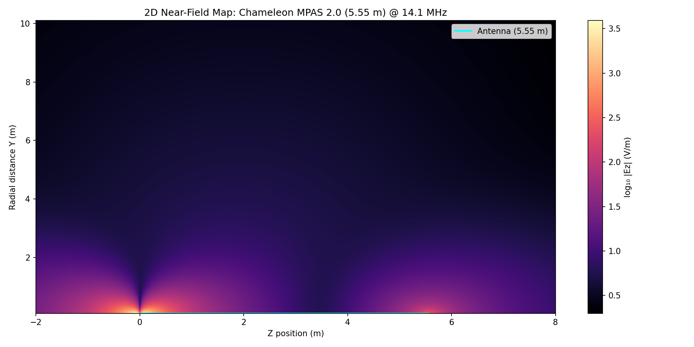

# SimpleMoM

2D near-field Ez simulation for a vertical wire antenna using a prescribed sinusoidal current distribution and the full Hertzian dipole radiation kernel.

## What it does

Computes the magnitude of the vertical electric field component (|Ez|) over a 2D grid in the r–z plane. Each segment of the antenna is treated as a Hertzian dipole and the contributions are summed:

```
Ez = Σ I(z') · dz' / (jωε₀) · G(R) · [k²sin²θ + (3cos²θ − 1)(1/R² + jk/R)]
```

where `G(R) = exp(−jkR) / (4πR)` is the free-space scalar Green's function. The near-field terms (`1/R²`, `jk/R`) are included, which dominate at observation distances much less than a wavelength.

## Default configuration

| Parameter | Value |
|---|---|
| Antenna | Chameleon MPAS 2.0 |
| Length | 5.55 m |
| Frequency | 14.1 MHz (20 m band) |
| Segments | 500 |
| Grid | 1000 × 1000 |
| Threads | 8 |
| View | z ∈ [−2, 8] m, y ∈ [0.1, 10.1] m |

## Build

Requires a C++20 compiler and CMake ≥ 4.0.

```bash
cmake -B build
cmake --build build -j$(nproc)
```

## Run

```bash
./build/SimpleMoM
```

Writes `field_map.bin` — 1 000 000 little-endian `double` values, row-major, matching the grid bounds above.

## Plot

Open `plot-e-field.ipynb` in JupyterLab and run the cell, or:

```bash
jupyter nbconvert --to notebook --execute --inplace plot-e-field.ipynb
```


